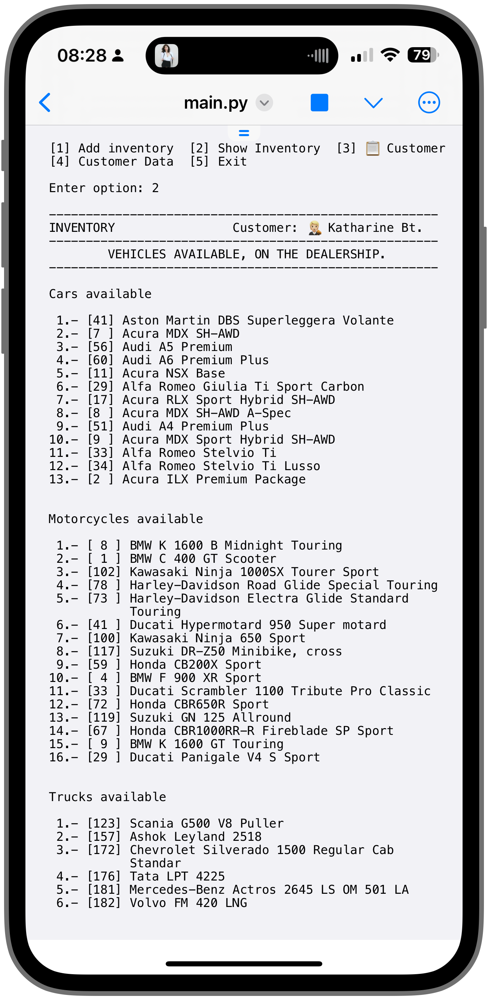
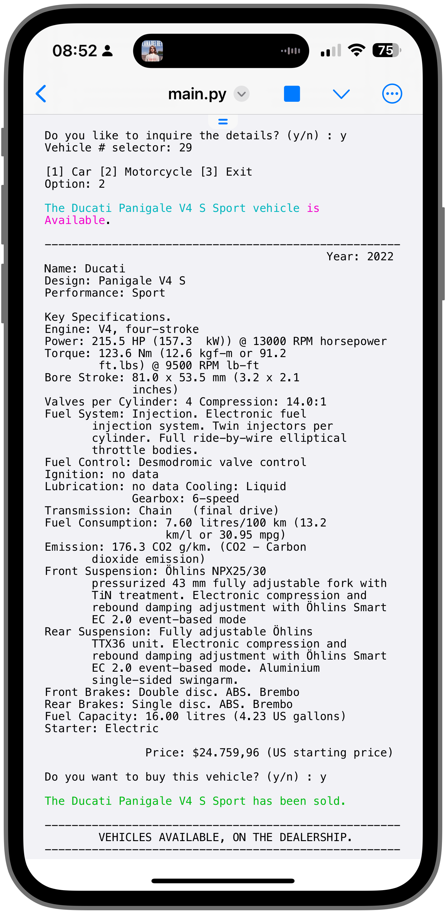
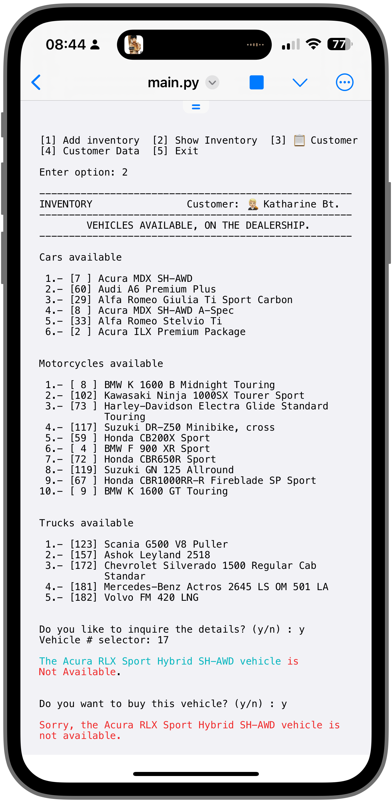
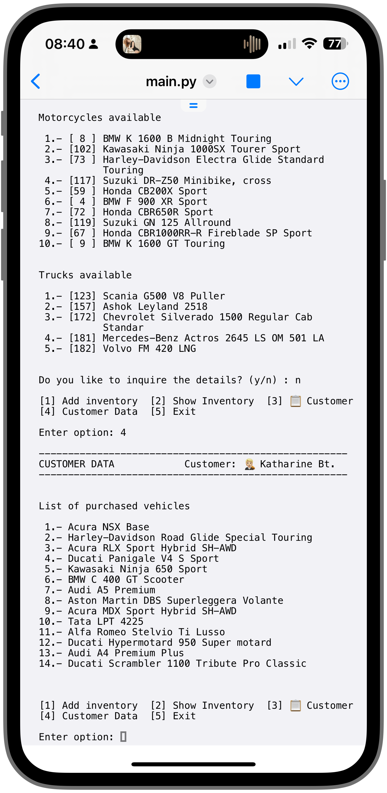

# dealershipsAPI
Dealerships Car, Motorcycles &amp; Trucks

```sh
cd dealershipAPI/
python3 main.py
```

<p align="center">
  
&nbsp; &nbsp; &nbsp; &nbsp;
  
</p>
<p align="center">
  
&nbsp; &nbsp; &nbsp; &nbsp;
  
</p>
<!-- <p align="center">
  
&nbsp; &nbsp; &nbsp; &nbsp;
  
</p> -->